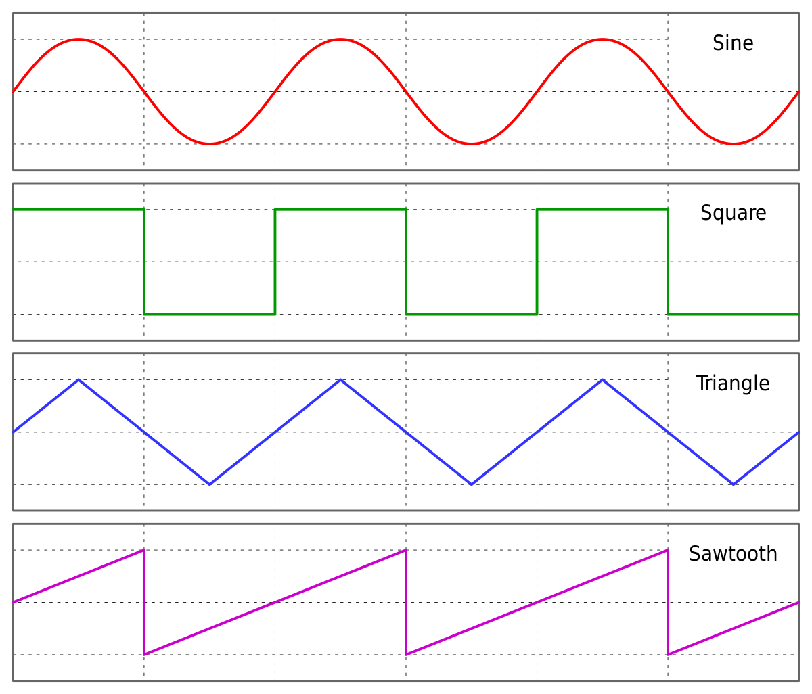
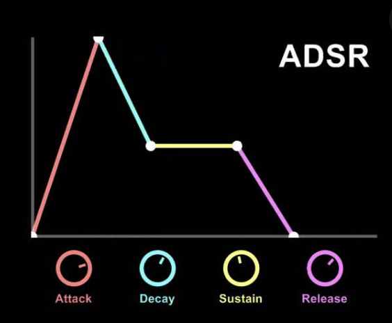

I finally found a youtube video about what I wanted to know. I didn't know what kind of knowledge of music production I should get next, but this was it.

<iframe width="560" height="315" src="https://www.youtube.com/embed/atvtBE6t48M" title="YouTube video player" frameborder="0" allow="accelerometer; autoplay; clipboard-write; encrypted-media; gyroscope; picture-in-picture" allowfullscreen></iframe>

## 3 Elements of Sound
1. Pitch（高さ）
2. Timbre（音色）
3. Harmonics

## 5 most common Waveforms

1. Square Wave
2. Sawtooth Wave
3. Triangle Wave
4. Pulse Wave
5. Sine Wave

## 7 Components of Synth

1. Amplifier
1. Oscillator
1. Filter
1. Volume Envelope
1. Filter Envelope
1. Pitch Envelope
1. LFO